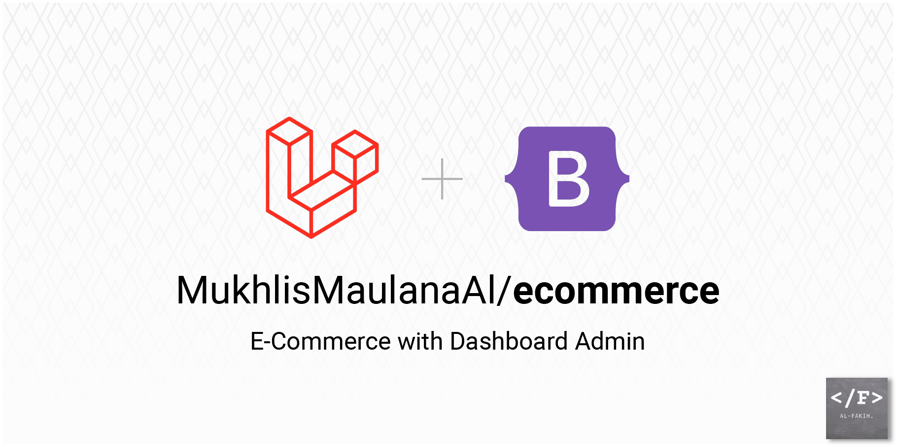

<h1 align="center">Laravel - E-Commerce</h1>



Welcome to the **Laravel Online Store** project! This project is an e-commerce platform currently under development. It utilizes **Laravel** for the backend, **Bootstrap 5** for the frontend, and integrates key functionalities like payment processing using **Midtrans API** and shipping rate calculations with the **RajaOngkir API**. The project is in its development stage, focusing on building the **Admin Dashboard** to manage the store.


## 🚀 Features

- **Admin Dashboard** for managing products, orders, and customers (In progress)
- **Product Management**: Add, edit, delete, and manage product listings
- **Payment Gateway Integration** with **Midtrans** for seamless transactions
- **Shipping Cost Checker** using **RajaOngkir API** for real-time postage estimates
- **Responsive Design**: Built using **Bootstrap 5** for a mobile-friendly interface
- **User Authentication**: Secure user registration and login system (Coming soon)

## 🛠️ Tech Stack

- **Backend**: [Laravel](https://laravel.com/)
- **Frontend**: [Bootstrap 5](https://getbootstrap.com/)
- **Payment Gateway**: [Midtrans API](https://midtrans.com/)
- **Shipping Cost API**: [RajaOngkir API](https://rajaongkir.com/)
- **Database**: MySQL (or any Laravel-supported database)
- **Version Control**: Git

## ⚙️ Installation & Setup

Follow the steps below to set up the project on your local machine:

1. **Clone the repository**:
    ```bash
    git clone https://github.com/MukhlisMaulanaA/ecommerce.git
    cd ecommerce
    ```

2. **Install dependencies**:
    Make sure you have [Composer](https://getcomposer.org/) installed. Then, run:
    ```bash
    composer install
    ```

3. **Install front-end dependencies**:
    Make sure you have [Node.js](https://nodejs.org/) and npm installed. Then, run:
    ```bash
    npm install
    ```

4. **Set up environment variables**:
    Duplicate the `.env.example` file and rename it to `.env`. Update the following variables to match your configuration:
    ```bash
    APP_NAME=LaravelStore
    APP_URL=http://localhost:8000

    DB_CONNECTION=mysql
    DB_HOST=127.0.0.1
    DB_PORT=3306
    DB_DATABASE=your_database
    DB_USERNAME=your_username
    DB_PASSWORD=your_password

    MIDTRANS_SERVER_KEY=your_midtrans_server_key
    RAJAONGKIR_API_KEY=your_rajaongkir_api_key
    ```

5. **Generate application key**:
    ```bash
    php artisan key:generate
    ```

6. **Run database migrations**:
    Ensure your database is set up, then run:
    ```bash
    php artisan migrate
    ```

7. **Start the development server**:
    Finally, to launch the application, run:
    ```bash
    php artisan serve
    ```

    You should now be able to access the app at `http://localhost:8000`.

## 🧪 Testing Payment and Shipping Integration

- **Midtrans**: Ensure that you have set up a Midtrans account and obtained the necessary keys for testing. You can use Midtrans' sandbox mode for testing payment flows.
- **RajaOngkir**: Create an account on RajaOngkir to get the API key. Use their endpoints to check shipping rates between various cities or locations.

## 🛡️ Security & Authentication

- The project uses Laravel's built-in authentication scaffolding.
- Ensure you configure proper authentication and authorization for admin and customer areas to prevent unauthorized access.

## 🌱 Project Status

The project is currently **in development**. The focus is on building out the **Admin Dashboard** and integrating core functionalities like product management and payment processing.

### Upcoming Features

- 📦 Full-featured **Product Catalog**
- 🛒 **Shopping Cart** and **Checkout Process**
- 📧 **Order Notifications** via email
- 📊 **Sales Analytics** on the dashboard
- 🔒 **Customer Accounts** and **Order History**

## 🤝 Contributing

Contributions are welcome! If you'd like to contribute, please follow these steps:

1. Fork the repository.
2. Create a new feature branch (`git checkout -b feature/YourFeature`).
3. Commit your changes (`git commit -m 'Add some feature'`).
4. Push to the branch (`git push origin feature/YourFeature`).
5. Open a Pull Request.

## 📝 License

This project is licensed under the MIT License. See the [LICENSE](LICENSE) file for more details.

## 📞 Contact

For any inquiries or feedback, feel free to reach out:

- Email: mukhlis.maulanaalf@gmail.com
- LinkedIn: [Mukhlisalf](www.linkedin.com/in/mukhlisalf)

---

Happy coding! 😄